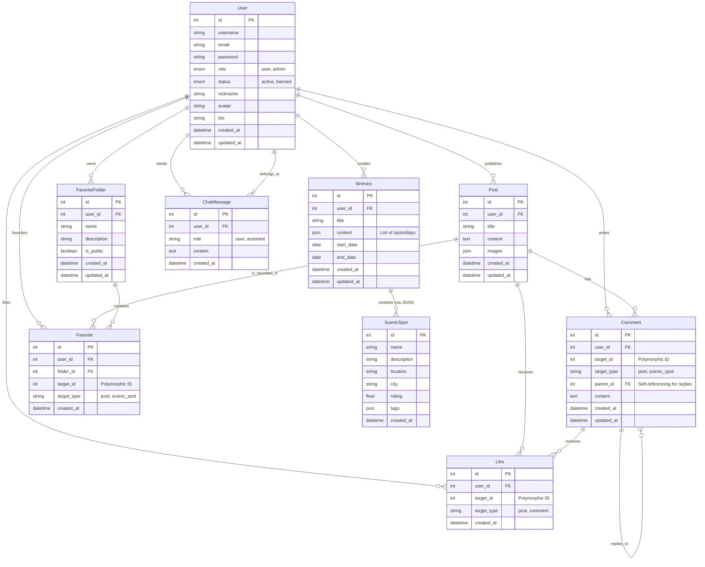

# 数据表关系模型 (Data Model)

## 1. 实体关系图 (Entity Relationship Diagram)

## 2. 数据字典 (Data Dictionary)

### 2.1 用户表 (`users`)
| 字段名 | 类型 | 必填 | 说明 |
| :--- | :--- | :--- | :--- |
| `id` | INT | Yes | 主键，自增 |
| `username` | VARCHAR(50) | Yes | 用户名，唯一 |
| `email` | VARCHAR(100) | Yes | 邮箱，唯一 |
| `password` | VARCHAR(255) | Yes | 加密后的密码 |
| `role` | ENUM('user', 'admin') | Yes | 角色，默认 'user' |
| `status` | ENUM('active', 'banned') | Yes | 账号状态，默认 'active' |
| `nickname` | VARCHAR(50) | No | 昵称 |
| `avatar` | VARCHAR(255) | No | 头像 URL |
| `bio` | VARCHAR(255) | No | 个人简介 |
| `created_at` | DATETIME | Yes | 创建时间 |
| `updated_at` | DATETIME | Yes | 更新时间 |

### 2.2 帖子表 (`posts`)
| 字段名 | 类型 | 必填 | 说明 |
| :--- | :--- | :--- | :--- |
| `id` | INT | Yes | 主键，自增 |
| `user_id` | INT | Yes | 外键，关联 `users.id` |
| `title` | VARCHAR(255) | Yes | 帖子标题 |
| `content` | TEXT | Yes | 帖子内容 |
| `images` | JSON | No | 图片 URL 数组 |
| `created_at` | DATETIME | Yes | 发布时间 |
| `updated_at` | DATETIME | Yes | 更新时间 |

### 2.3 行程表 (`itineraries`)
| 字段名 | 类型 | 必填 | 说明 |
| :--- | :--- | :--- | :--- |
| `id` | INT | Yes | 主键，自增 |
| `user_id` | INT | Yes | 外键，关联 `users.id` |
| `title` | VARCHAR(255) | Yes | 行程标题 |
| `content` | JSON | Yes | 行程详细内容（每日安排、景点列表等结构化数据） |
| `start_date` | DATE | No | 开始日期 |
| `end_date` | DATE | No | 结束日期 |
| `created_at` | DATETIME | Yes | 创建时间 |
| `updated_at` | DATETIME | Yes | 更新时间 |

### 2.4 评论表 (`comments`)
| 字段名 | 类型 | 必填 | 说明 |
| :--- | :--- | :--- | :--- |
| `id` | INT | Yes | 主键，自增 |
| `user_id` | INT | Yes | 外键，关联 `users.id` |
| `target_id` | INT | Yes | 评论目标 ID (Post ID 或 ScenicSpot ID) |
| `target_type` | VARCHAR(50) | Yes | 评论目标类型 ('post', 'scenic_spot') |
| `parent_id` | INT | No | 父评论 ID (用于回复)，关联 `comments.id` |
| `content` | TEXT | Yes | 评论内容 |
| `created_at` | DATETIME | Yes | 评论时间 |

### 2.5 点赞表 (`likes`)
| 字段名 | 类型 | 必填 | 说明 |
| :--- | :--- | :--- | :--- |
| `id` | INT | Yes | 主键，自增 |
| `user_id` | INT | Yes | 外键，关联 `users.id` |
| `target_id` | INT | Yes | 点赞目标 ID |
| `target_type` | VARCHAR(50) | Yes | 点赞目标类型 ('post', 'comment') |
| `created_at` | DATETIME | Yes | 点赞时间 |

### 2.6 收藏表 (`favorites`)
| 字段名 | 类型 | 必填 | 说明 |
| :--- | :--- | :--- | :--- |
| `id` | INT | Yes | 主键，自增 |
| `user_id` | INT | Yes | 外键，关联 `users.id` |
| `folder_id` | INT | Yes | 外键，关联 `favorite_folders.id` |
| `target_id` | INT | Yes | 收藏目标 ID |
| `target_type` | VARCHAR(50) | Yes | 收藏目标类型 ('post', 'scenic_spot') |
| `created_at` | DATETIME | Yes | 收藏时间 |

### 2.7 收藏夹表 (`favorite_folders`)
| 字段名 | 类型 | 必填 | 说明 |
| :--- | :--- | :--- | :--- |
| `id` | INT | Yes | 主键，自增 |
| `user_id` | INT | Yes | 外键，关联 `users.id` |
| `name` | VARCHAR(100) | Yes | 收藏夹名称 |
| `description` | VARCHAR(255) | No | 描述 |
| `is_public` | BOOLEAN | Yes | 是否公开，默认 false |
| `created_at` | DATETIME | Yes | 创建时间 |
