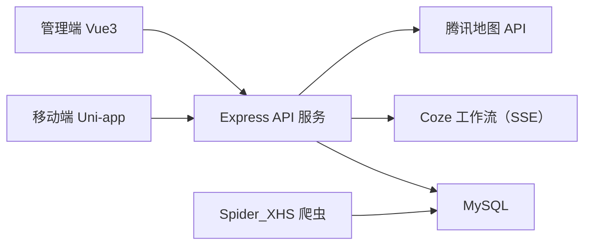

# 基于 AI 与社交内容融合的旅行规划系统设计与实现（初稿）

作者：张晰  
学院：数字媒体与设计艺术学院  
专业：数字媒体技术（示例）  
日期：2026 年 4 月

---

## 摘要

随着国内自由行需求快速增长，用户在制定出行计划时普遍面临“信息分散、决策成本高、路线不连贯”三类问题。传统攻略平台能够提供海量内容，但在“把碎片化经验转化为可执行行程”方面仍然依赖用户手动整理，效率较低。针对上述痛点，本文围绕“内容发现 + AI 生成 + 行程编辑 + 地图导航 + 社交反馈”构建了一套旅行规划系统，并完成了前后端与管理端的工程化实现。

本系统采用三端协同架构：移动端基于 Uni-app + Vue3 + Pinia，后端基于 Node.js + Express + Sequelize + MySQL，管理端基于 Vue3 + Element Plus + ECharts。系统核心功能包括：用户认证与资料管理、旅行笔记发布与瀑布流检索、点赞评论收藏关注通知、AI 对话式行程生成、可编辑的线性行程节点管理、腾讯地图路径规划、管理员内容审核与数据看板。同时，为解决冷启动内容不足问题，本文实现了小红书攻略采集链路，形成“采集—去重—入库”的数据补充流程。

在技术实现上，系统通过 JWT 完成鉴权闭环，采用统一 `ResponseUtil` 输出接口结果；在 AI 能力接入上，后端通过 SSE 流式转发 Coze 工作流结果，实现“边思考边返回”的前端交互；在行程数据结构上，设计了以 `dayIndex/sequence` 为核心的线性节点模型，支持节点增删改查与重排；在地图能力上，封装腾讯地图检索、地理编码与路径规划能力，并实现轨迹折线解压。  
在数据采集方面，本项目当前主流程使用 **Spider_XHS 接口方式（非 Playwright）** 进行小红书内容抓取，结合本地去重与数据库导入，已在本地形成中文与英文旅行笔记数据集，为内容广场与 AI 生成提供了真实语料支撑。

综合联调结果表明，该系统能够覆盖旅行规划主要业务闭环，具备较好的可扩展性与工程可维护性。本文最后总结了系统现存问题，并提出后续在推荐算法、审核自动化与多模态行程生成方面的优化方向。

**关键词**：旅行规划；Uni-app；Express；SSE；Coze 工作流；Spider_XHS；腾讯地图；毕业设计

---

## 第一章 绪论

### 1.1 研究背景与问题提出

在移动互联网环境下，用户获取旅行信息的渠道更加丰富，小红书、抖音、社区论坛等平台每天产生大量目的地相关内容。然而，用户真正完成一次旅行决策仍要经历“找信息—筛选信息—组织路线—执行计划”多个步骤。现有平台通常侧重内容展示，缺少将内容直接转化为结构化行程的能力，导致以下问题：

1. 信息获取成本高：同一目的地内容分散在多个帖子中，用户需要反复比对。  
2. 路线组织效率低：用户常用记事本手工拼接行程，缺乏时间与空间上的连贯性。  
3. 动态调整困难：行程执行中遇到天气、预算、时间变化时，难以快速重排。

因此，设计一个同时具备内容聚合、智能生成、可编辑执行与社交反馈的旅行系统，具有明确的实践价值。

### 1.2 研究目标

本文以“可落地可演示”为目标，完成以下任务：

1. 构建支持多角色的旅行平台（普通用户与管理员）。  
2. 实现覆盖发布、浏览、互动、生成、编辑、导航、审核的完整业务链。  
3. 设计可维护的后端 API 与数据模型，保证后续扩展性。  
4. 引入 AI 流式交互机制，提升行程生成的可解释性与使用体验。  
5. 接入外部内容采集能力，为系统冷启动阶段提供真实旅行语料。

### 1.3 研究内容与本文贡献

结合项目代码落地，本文主要贡献如下：

1. 设计并实现三端协同架构：移动端、后端服务、管理后台职责清晰。  
2. 构建“帖子 -> AI 行程 -> 可编辑节点 -> 地图路线”闭环流程。  
3. 采用 SSE 流式通信，支持聊天与帖子行程生成的实时返回。  
4. 基于线性节点模型实现行程精细化编辑（节点级增删改查与重排）。  
5. 完成小红书采集链路工程化（Spider_XHS 抓取、去重、入库），并支持中英文数据流。

### 1.4 论文结构安排

1. 第一章：绪论，阐述研究背景、目标与论文结构。  
2. 第二章：相关技术综述，介绍系统实际采用的关键技术。  
3. 第三章：需求分析与系统设计，描述业务需求、架构与数据设计。  
4. 第四章：系统实现，按真实模块展开实现细节。  
5. 第五章：测试、总结与展望，给出验证结果与后续改进方向。

---

## 第二章 相关技术综述

> 本章仅讨论本项目中“实际使用”的技术栈与方法。

### 2.1 Uni-app 与 Vue3 跨端开发技术

移动端采用 Uni-app + Vue3 开发，优势是“一套代码多端发布”，可兼顾 H5 与小程序形态。项目中通过 `pages.json` 定义页面路由，覆盖登录、首页、聊天、行程、通知、个人中心等页面。状态管理采用 Pinia，并通过持久化插件保存用户登录态，降低重复登录成本。  
在国际化方面，前端使用 `vue-i18n`，已支持中英文切换，与后端 `lang` 字段协同实现多语言内容展示。

### 2.2 Node.js + Express 后端服务框架

后端采用 Express 构建 REST API，路由按业务域拆分为 `auth/posts/chat/itineraries/social/follow/notifications/map/admin` 等模块，降低耦合度。  
Express 在本项目中的价值主要体现在：

1. 路由分层清晰，便于模块化扩展。  
2. 中间件机制完善，便于鉴权、异常处理、日志治理。  
3. 与前端 JSON 协议配合紧密，联调效率高。

### 2.3 Sequelize ORM 与 MySQL 数据持久化

项目采用 Sequelize 进行模型定义与关联管理，核心数据表包括 `users/posts/comments/likes/favorites/follows/notifications/itineraries/chat_messages/reports`。  
ORM 的引入减少了手写 SQL 的重复劳动，同时通过模型关联简化了复杂查询，例如：

1. `Post` 关联 `User/Like/Favorite` 用于广场与详情聚合。  
2. `Comment` 自关联支持二级回复。  
3. `Follow` 双外键实现粉丝与关注关系。  
4. `Itinerary.content` 采用 JSON 存储线性节点结构，兼顾灵活性。

### 2.4 JWT 鉴权与权限控制

系统登录后由后端签发 JWT，前端在请求头携带 `Authorization: Bearer <token>`。  
在权限设计上，系统区分“可选鉴权”和“强制鉴权”两类接口：

1. 帖子列表/详情支持可选鉴权：未登录可浏览，登录后可返回 `isLiked/isFavorited`。  
2. 发帖、评论、关注、通知、行程管理等接口要求强制鉴权。  
3. 管理端接口叠加管理员角色中间件，确保审核功能隔离。

### 2.5 SSE 流式通信与 Coze 工作流接入

AI 相关能力采用 SSE（Server-Sent Events）实现流式返回。后端在 `chat` 与 `posts/:id/generate-itinerary` 接口中设置 `text/event-stream`，将 Coze 工作流输出按 `thinking/content/chunk/done` 事件推送给前端。  
前端封装 `sseRequest`，实现统一解析与回调，用户可实时看到模型输出过程，而非等待单次大响应。该机制显著提升了交互即时性，也有助于展示 AI 的中间推理文本（thinking）。

### 2.6 腾讯地图开放平台能力

项目接入腾讯地图 API 实现地点检索、地理编码、路线规划与轨迹解析。  
核心实现点包括：

1. 地点检索：关键词 + 区域约束，失败时回退到地址解析。  
2. 路线规划：支持驾车/步行/骑行/公交模式。  
3. 轨迹处理：对返回 polyline 进行前向差分解压，获得可绘制坐标点。  
4. 行程增强：自动补全节点缺失经纬度，提升地图显示完整性。

### 2.7 小红书采集技术：Spider_XHS（主）与 Playwright（历史方案）

本项目爬虫目录同时存在 `crawler.py`（Playwright 方案）与 `crawl_spider.py`/`crawl_spider_en.py`（Spider_XHS 方案）。  
结合当前数据链路与脚本使用情况，本项目在论文中采用 **Spider_XHS 方案作为正式实现**，主要原因：

1. 采集流程更接近接口级抓取，效率更高。  
2. 具备中英文双语采集脚本，且英文脚本包含文本语言过滤。  
3. 已配套去重与导入脚本，形成完整工程流水线。  

因此，Playwright 方案在本文中定位为早期探索/兜底，不作为最终主线方法。

---

## 第三章 系统需求分析与总体设计

### 3.1 业务场景与用户角色

系统面向三类使用主体：

1. 普通用户：浏览攻略、发布笔记、互动、生成并管理行程。  
2. 内容生产者：持续发布旅行内容，积累粉丝与互动数据。  
3. 管理员：在后台完成用户、帖子、评论、举报治理。

整体业务流程可概括为：  
用户注册登录 -> 浏览/搜索内容 -> 触发 AI 生成行程 -> 编辑节点并查看路线 -> 执行与分享 -> 社交互动反馈 -> 管理端治理。

### 3.2 功能需求分析

按模块划分的核心功能需求如下：

1. 账户模块：注册、登录、找回密码、资料维护。  
2. 内容模块：发帖、删帖、瀑布流列表、详情查看、关键词与标签筛选。  
3. 社交模块：点赞、评论、二级回复、收藏、关注、通知。  
4. 行程模块：AI 生成、保存、详情、节点增删改、节点重排、删除。  
5. 地图模块：地点检索、节点坐标补全、路线规划、批量分段路线。  
6. 管理模块：仪表盘统计、用户管理、帖子管理、评论管理、举报处理。  
7. 数据补充模块：小红书采集、去重与导库。

### 3.3 非功能需求分析

1. 可用性：核心功能在移动端高频场景下可稳定完成。  
2. 安全性：接口鉴权、权限边界明确，避免越权操作。  
3. 可维护性：路由、控制器、服务层分离，便于功能迭代。  
4. 扩展性：行程内容使用 JSON 结构，适配未来字段扩展。  
5. 兼容性：前端支持中英文、多端构建，后端接口保持统一协议。

### 3.4 系统总体架构设计

系统采用“前端应用 + 后端 API + 外部服务 + 数据库”架构：

架构说明：

1. 移动端与管理端共享后端 API 能力，但权限体系隔离。  
2. AI 与地图能力由后端统一封装，前端不直接持有第三方密钥。  
3. 爬虫以离线流程补充内容池，降低冷启动阶段内容稀缺问题。

### 3.5 数据库设计要点

1. 用户表（users）：保存账号、角色、状态、头像、语言偏好。  
2. 帖子表（posts）：包含标题、正文、图片数组、标签、地理字段、语言字段。  
3. 行程表（itineraries）：`content` 使用 JSON 存储线性节点。  
4. 互动表：`likes/comments/favorites/follows/notifications/reports` 组成社交闭环。  
5. 聊天表（chat_messages）：保存会话历史，支持上下文续聊。

### 3.6 接口设计规范

项目统一返回结构 `{ code, data, message/msg }`，前端 `request.ts` 做统一解包与错误提示。  
在异常策略上，401 会自动清理登录态并跳转登录页；业务异常统一 toast 提示，降低组件内重复处理逻辑。

---

## 第四章 系统详细实现

### 4.1 用户与权限模块实现

#### 4.1.1 注册登录与密码管理

认证接口位于 `authRoutes`，包含：

1. `POST /auth/register`：注册。  
2. `POST /auth/login`：支持用户名或邮箱登录。  
3. `POST /auth/forgot-password`：邮箱验证。  
4. `POST /auth/reset-password`：重置密码。

后端在 `authController` 中使用 Joi 进行参数校验，在 `authService` 中调用 `bcryptjs` 与 `jsonwebtoken` 完成密码与令牌处理。该分层方式将“参数校验”与“业务逻辑”分离，便于后续替换短信验证码、邮箱验证码等机制。

#### 4.1.2 鉴权中间件与权限边界

`authMiddleware` 完成 Bearer Token 解析、JWT 校验与用户存在性检查。  
权限边界策略如下：

1. 公共读接口可匿名访问（如帖子列表/详情）。  
2. 写操作接口必须登录（发帖、互动、行程管理）。  
3. 管理端接口要求管理员身份。

该策略在保证用户浏览便捷性的同时，避免匿名写入带来的内容污染风险。

### 4.2 内容广场模块实现

#### 4.2.1 帖子发布

`POST /posts` 支持提交标题、正文、图片、地点、标签、隐私级别、语言等字段。  
`uploadRoutes` 结合 multer 提供文件上传，限制单文件 5MB，并生成 `/uploads/...` 可访问 URL。

#### 4.2.2 帖子列表与筛选

`getPosts` 支持以下查询条件：

1. 分页：`page/limit`。  
2. 信息流：`feed=recommend/following`。  
3. 过滤：`userId/keyword/tag/lang/type`。  

其中 `tag` 使用 MySQL `JSON_CONTAINS` 完成标签过滤，`following` 模式通过关注关系反查用户集合，再查询对应公开帖子。  
接口返回时会附带点赞状态并执行图片地址改写（兼容外部图链与本地兜底图）。

#### 4.2.3 帖子详情聚合

`GET /posts/:id` 除帖子主体外，还聚合点赞数、评论数、收藏数、当前用户点赞收藏状态，为前端详情页一次性提供渲染数据，减少多次请求。

### 4.3 社交互动模块实现

#### 4.3.1 点赞收藏

`socialController.toggleLike` 与 `toggleFavorite` 使用“存在即取消，不存在即新增”的幂等模式。点赞成功后会根据目标对象（帖子或评论）自动创建通知。

#### 4.3.2 评论与二级回复

评论模型包含 `parent_id` 与 `reply_to_user_id`，支持楼中楼回复。  
`getComments` 返回一级评论并附带前几条回复，`getReplies` 进行分页补齐，兼顾首屏性能与完整性。

#### 4.3.3 关注与通知

关注接口支持关注、取关、关系检查、关注列表、粉丝列表。  
通知接口支持通知列表、未读数、单条已读、全部已读，形成完整的社交反馈机制。

### 4.4 AI 对话与行程生成模块实现

#### 4.4.1 对话会话管理

聊天模块接口为：

1. `POST /chat/session`：创建会话 ID。  
2. `POST /chat/message`：SSE 流式回复。  
3. `GET /chat/history/:sessionId`：拉取历史消息。

消息入库策略为“用户消息先落库，AI 结束回调后再落库 assistant 消息”，保证会话上下文可追踪。

#### 4.4.2 SSE 流式传输机制

后端 `cozeWorkflowService` 将第三方流式事件转发为标准 SSE；前端 `utils/sse.ts` 按事件类型分发：

1. `thinking`：展示思考片段。  
2. `content/chunk`：增量更新文本。  
3. `done`：结束并返回结构化 payload。

该机制同样复用于“从帖子一键生成行程”接口 `POST /posts/:id/generate-itinerary`，用户可直接把攻略内容转为草案行程。

### 4.5 行程管理与地图模块实现

#### 4.5.1 线性节点模型

行程 `content` 采用线性节点结构，核心字段包括：

1. `dayIndex/sequence`：天序与序号。  
2. `timeSlot/title/location`：时间与地点信息。  
3. `latitude/longitude/address`：地理信息。  
4. `cost/durationMin/status`：执行成本与状态。  

该模型相比纯文本行程更适合节点级编辑和地图计算。

#### 4.5.2 节点级 CRUD 与重排

接口支持：

1. `PATCH /itineraries/:id/nodes/:nodeId`：更新节点。  
2. `POST /itineraries/:id/nodes`：新增节点。  
3. `DELETE /itineraries/:id/nodes/:nodeId`：删除节点。  
4. `POST /itineraries/:id/nodes/reorder`：调整顺序。  

`itineraryService` 在每次写操作后都会重新归一化节点顺序并刷新 `summary`，避免前端多次拖拽后数据紊乱。

#### 4.5.3 地图坐标补全与路线规划

为提升可视化完整性，系统在读取行程详情时会对缺失经纬度的节点进行补全。  
地图接口除单段路线外，还支持 `route-batch` 批量计算分段路径，失败时自动降级直线段，确保前端路线图可稳定渲染。

### 4.6 管理后台实现

管理端由 Vue3 + Element Plus 构建，主要页面包括仪表盘、用户管理、帖子管理、评论管理、举报管理。  
仪表盘接入后端统计接口，展示总量指标、7 日趋势和帖子类型分布。  
后台路由通过 `beforeEach` 校验 `admin_token`，未登录跳转登录页，实现管理入口隔离。

### 4.7 小红书采集链路实现（重点）

#### 4.7.1 采集方案与脚本组织

本项目爬虫位于 `xhs-crawler`，正式主链路如下：

1. `crawl_spider.py`：中文攻略抓取，输出 `data/raw/`。  
2. `crawl_spider_en.py`：英文攻略抓取，输出 `data/raw_en/`，并进行英文过滤。  
3. `dedup_local.py` / `dedup_local_en.py`：按 `xhs_note_id` 去重。  
4. `db_import.py` / `db_import_en.py`：导入 MySQL `posts` 表。

其中 `crawl_spider_en.py` 中对文本 CJK 占比做阈值判断，过滤非英文内容，确保英文数据质量。

#### 4.7.2 数据字段映射

采集记录统一映射为：

1. `xhs_note_id`：内容唯一标识。  
2. `title/content/content_html`：标题与正文。  
3. `images`：图片数组。  
4. `tags`：标签。  
5. `source/lang`：来源与语言标记。

导库时会将数组字段序列化为 JSON，语言写入 `posts.lang`，并通过专用爬虫账号归属内容来源。

#### 4.7.3 当前数据规模（本地统计）

截至本次论文初稿整理时，本地数据规模如下：

1. `data/raw`：308 条原始中文记录文件。  
2. `data/raw_en`：78 条原始英文记录文件。  
3. `notes_deduped.json`：约 306 条去重中文记录。  
4. `notes_deduped_en.json`：78 条去重英文记录。

上述数据已经可支撑内容广场冷启动展示与 AI 行程生成测试。

#### 4.7.4 关于 Playwright 的说明

目录中保留 `crawler.py`（Playwright）作为早期实验/备用脚本；本文正式实现与结果章节统一采用 Spider_XHS 主链路，以避免论文实现与实际运行链路不一致。

### 4.8 工程化细节补充

1. 后端启动时自动 `sequelize.sync()` 并补齐增量字段。  
2. 请求异常统一走全局错误处理与 `ResponseUtil`。  
3. 前端 `request.ts` 对 401 自动退登并跳转登录。  
4. 评论、通知、关注等模块均支持分页，控制单次返回体量。  
5. 图片上传与静态资源路径分离，减少头像直存数据库的压力。

---

## 第五章 系统测试、总结与展望

### 5.1 测试目标与环境

测试目标主要覆盖功能正确性、接口连通性、关键交互稳定性。  
测试环境为本地联调环境：前端 Uni-app 开发模式、后端 Express 本地服务、MySQL 本地数据库、管理端 Vite 开发服务。

### 5.2 功能测试结果

| 编号 | 测试项 | 预期结果 | 实际结果 |
|---|---|---|---|
| T1 | 用户注册/登录 | 返回 token 与用户信息 | 通过 |
| T2 | 帖子发布 | 成功写入并可在广场显示 | 通过 |
| T3 | 帖子筛选 | 关键词/标签/语言筛选生效 | 通过 |
| T4 | 点赞取消 | 状态可切换且计数同步 | 通过 |
| T5 | 评论与回复 | 支持一级评论与二级回复 | 通过 |
| T6 | 收藏列表 | 收藏后可在活动页查看 | 通过 |
| T7 | 关注关系 | 关注/取关/检查状态正确 | 通过 |
| T8 | 通知中心 | 新互动产生未读通知 | 通过 |
| T9 | AI 聊天 | SSE 实时返回并落库 | 通过 |
| T10 | 帖子转行程 | 生成结果可保存与编辑 | 通过 |
| T11 | 节点重排 | 重排后 day/sequence 正确 | 通过 |
| T12 | 管理端审核 | 举报状态可更新，数据看板可展示 | 通过 |

### 5.3 稳定性与可用性观察

1. SSE 在网络波动场景下可能出现中断，当前前端已做 `done` 兜底。  
2. 地图路线在个别模糊地点会检索失败，系统可降级处理并保留原节点。  
3. 互动模块在高并发下可能出现短暂计数延迟，后续可增加缓存或消息队列优化。  
4. 管理端统计基于实时查询，数据量扩大后需进一步优化聚合策略。

### 5.4 现存问题与改进方向

1. 推荐机制仍以时间排序与基础筛选为主，缺少个性化推荐模型。  
2. 举报审核依赖人工操作，可加入规则引擎与文本风险识别。  
3. 行程生成目前以文本输入为主，可扩展图片、短视频等多模态输入。  
4. 爬虫链路建议补充调度器与增量更新策略，减少重复抓取成本。  
5. 测试体系以联调测试为主，后续需补齐自动化单测与接口回归测试。

### 5.5 全文总结

本文围绕旅行规划真实痛点，完成了一个从内容到执行的全流程系统。  
与仅做“攻略展示”或“单次 AI 生成”不同，本系统重点在于把碎片内容变成可维护、可调整、可导航、可互动的结构化行程，并通过管理端与数据采集能力保证平台可持续运营。  
从工程实现角度看，项目已具备清晰的模块边界与后续迭代基础，能够满足本科毕业设计“有完整系统、有核心技术点、有实际落地效果”的要求。

---

## 参考文献（占位版，后续请按你的文献清单替换）

[1] Fielding R T. Architectural Styles and the Design of Network-based Software Architectures[D]. UC Irvine, 2000.  
[2] Richardson C. Microservices Patterns[M]. Manning, 2018.  
[3] Vue.js Documentation[EB/OL]. https://vuejs.org/  
[4] Express.js Documentation[EB/OL]. https://expressjs.com/  
[5] Sequelize Documentation[EB/OL]. https://sequelize.org/  
[6] MySQL 8.0 Reference Manual[EB/OL]. https://dev.mysql.com/doc/  
[7] JSON Web Token (JWT) RFC 7519[EB/OL]. https://www.rfc-editor.org/rfc/rfc7519  
[8] 腾讯位置服务开发文档[EB/OL]. https://lbs.qq.com/  
[9] MDN Web Docs: Server-Sent Events[EB/OL]. https://developer.mozilla.org/  
[10] Pinia Official Documentation[EB/OL]. https://pinia.vuejs.org/

---

## 附录 A：可直接放到论文“实现章节”的项目模块映射

1. 用户认证：`backend/src/controllers/authController.js`、`backend/src/services/authService.js`。  
2. 内容广场：`backend/src/controllers/postController.js`、`frontend/src/pages/index/index.vue`。  
3. 社交互动：`backend/src/controllers/socialController.js`、`backend/src/controllers/followController.js`。  
4. 行程管理：`backend/src/services/itineraryService.js`、`frontend/src/stores/itinerary.ts`。  
5. AI 流式：`backend/src/services/cozeWorkflowService.js`、`frontend/src/utils/sse.ts`。  
6. 地图能力：`backend/src/services/mapService.js`。  
7. 管理后台：`admin/src/views/Dashboard.vue`、`admin/src/views/Reports.vue` 等。  
8. 数据采集：`xhs-crawler/crawl_spider.py`、`xhs-crawler/dedup_local.py`、`xhs-crawler/db_import.py`。

